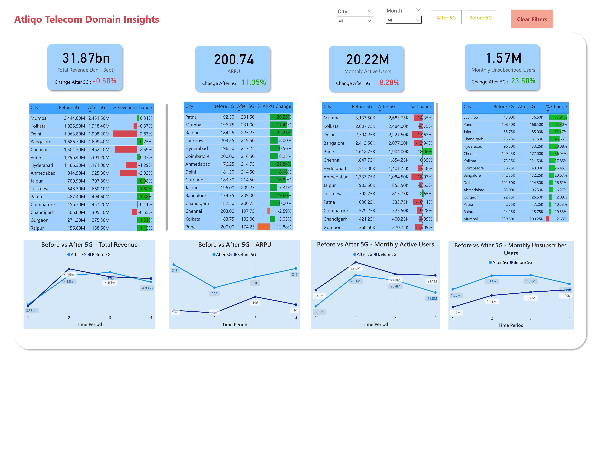

# 📡 AtliQo 5G Launch Impact Analysis – Data Analytics Dashboard

## 📌 Project Overview

AtliQo, a leading Indian telecom company, launched its 5G services in May 2022. While 5G was expected to boost performance, the company witnessed a decline in active users and revenue post-launch.

This Power BI dashboard project explores AtliQo's key performance metrics **before and after** the 5G rollout to uncover patterns, highlight problem areas, and recommend data-driven strategies to improve growth.

---

## 🎯 Objective

- Analyze how KPIs changed after the 5G launch (May 2022)
- Identify reasons behind the drop in revenue and user activity
- Evaluate internet plan performance across cities
- Study market share trends and competitive positioning
- Recommend actions to recover growth and improve retention

---

## 📊 Tools & Skills Used

- **Power BI** for interactive dashboard development  
- **DAX** for calculated measures and KPIs  
- **Data Modeling** using dimension and fact tables  
- **Exploratory Data Analysis** (EDA)  
- **Storytelling with Data** for executive-level reporting

---

## 📈 KPIs Analyzed

- Total Revenue  
- ARPU (Average Revenue Per User)  
- Monthly Active Users  
- Unsubscribed Users  
- Plan-wise Revenue Contribution  
- Market Share by Company & City

---

## 📊 Dashboard Snapshots

### 🔹 Page 1 – Revenue & User Metrics

---

### 🔹 Page 2 – Internet Plan Performance

---

### 🔹 Page 3 – Market Share Trends

---

## 💡 Key Insights

- 📉 Revenue dropped by **11%** after 5G, despite an **8.3% increase in ARPU**.
- 👥 Active users fell by **23.5%**, mainly in Lucknow, Pune, and Jaipur.
- 💰 Top 5 plans generated **~90% of all revenue** — indicating strong product focus.
- 🟡 Market share remained flat at **~19.5%**, showing no post-5G growth.
- 🏙️ Metro cities like Mumbai and Delhi performed best; smaller cities struggled.

---

## ✅ Recommendations

- Reintroduce flexible, low-cost plans for budget users
- Launch retention offers in high-loss cities (e.g., cashback, OTT bundles)
- Combine or replace underperforming plans (e.g., p9, p10, p13)
- Run referral and loyalty campaigns in Delhi, Kolkata, and Hyderabad
- Promote high ARPU plans in cities with fewer users but strong revenue

---

## 📁 Project Files

- `AtliQo_5G_Impact_Dashboard.pbix`  
- Dataset CSV files (dimensions & facts)  
- Project Summary PDF  
- Dashboard screenshots (in `images/` folder)

---

## 🙋‍♂️ About Me

**T. Achuth Kumar**  
Aspiring Data Analyst | Passionate about transforming data into strategy  
📧 [Your Email]  
🔗 [LinkedIn Profile](https://www.linkedin.com/in/achuthkumar-telugu/) 

---

